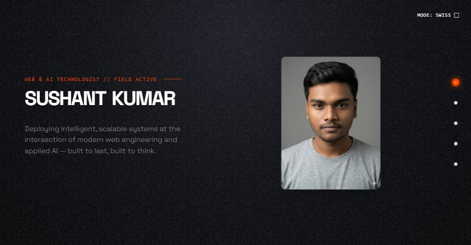

<div align="center">

</div>

# Sushant Kumar — Developer Portfolio

A **brutalist-kinetic** personal portfolio built with React, TypeScript, and Framer Motion. Showcasing projects, internship experience, and social links.

---

## 🚀 Tech Stack

| Technology | Version |
|---|---|
| React | ^19.2.1 |
| TypeScript | ~5.8.2 |
| Vite | ^6.2.0 |
| Tailwind CSS | ^4.3.3 |
| Framer Motion | ^12.23.25 |
| Lucide React | ^0.555.0 |

---

## 💼 Experience

| # | Company | Role | Period |
|---|---|---|---|
| 01 | Microsoft · Edunet Foundation · AICTE | AI Foundations Intern | April 2025 – May 2025 |
| 02 | IBM SkillsBuild · CSRBOX Foundation | AI Agent Architecture Trainee | July 2025 – August 2025 |
| 03 | 1M1B · AICTE · Salesforce India · SEMI | Green Skills Intern | July 2025 – September 2025 (7 Weeks) |

---

## 🛠️ Projects

| # | Project | Category | Live | Source |
|---|---|---|---|---|
| 1 | **PLAYCE** | Productivity | [playce-three.vercel.app](https://playce-three.vercel.app/) | [GitHub](https://github.com/ZackSatrday/PLAYCE) |
| 2 | **Mental Wellness App** | AI · HealthTech | [mental-health-app-wheat.vercel.app](https://mental-health-app-wheat.vercel.app/) | [GitHub](https://github.com/ZackSatrday/Mental-health-app) |
| 3 | **Diabatic-Ai** | Healthcare | [se-project-red.vercel.app](https://se-project-red.vercel.app/) | [GitHub](https://github.com/ZackSatrday/medical_diagnosis) |
| 4 | **EduVidwan** | Education | [eduvidwaan-new-v.vercel.app](https://eduvidwaan-new-v.vercel.app/) | [GitHub](https://github.com/ZackSatrday/eduvidwaan-newV) |
| 5 | **Liqupsy** | Entertainment | [liqu-psy.netlify.app](https://liqu-psy.netlify.app/) | [GitHub](https://github.com/ZackSatrday/LiquPsy) |
| 6 | **REDEFINE** | Gaming | [refine-gaming.netlify.app](https://refine-gaming.netlify.app/) | [GitHub](https://github.com/ZackSatrday/GamingWebsite) |

---

## 🔗 Connect

- **GitHub**: [@ZackSatrday](https://github.com/ZackSatrday)
- **LinkedIn**: [Sushant Kumar](https://www.linkedin.com/in/sushant-kumar-244145211/)
- **Email**: [sushant.dev113@gmail.com](mailto:sushant.dev113@gmail.com)

---

## 🏃 Run Locally

**Prerequisites:** Node.js

1. Install dependencies:
   ```bash
   npm install
   ```
2. Start the dev server:
   ```bash
   npm run dev
   ```
3. Build for production:
   ```bash
   npm run build
   ```
